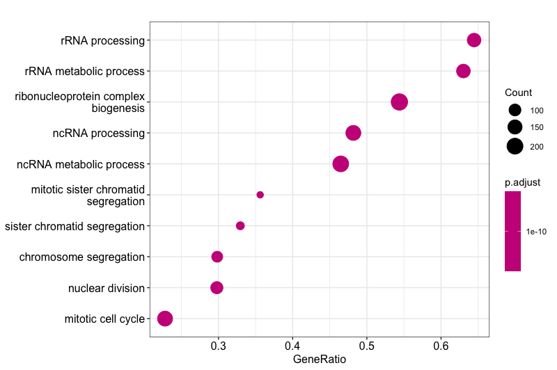
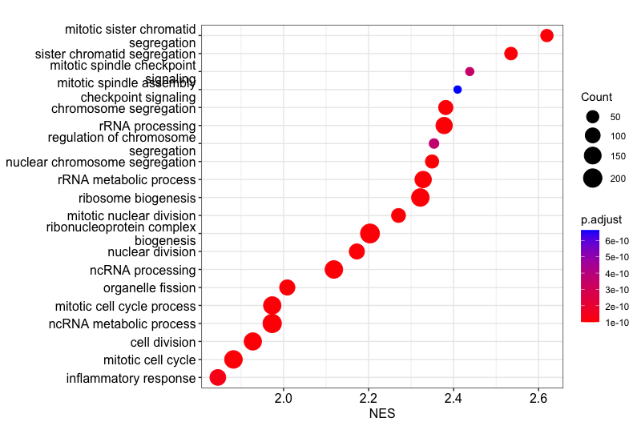
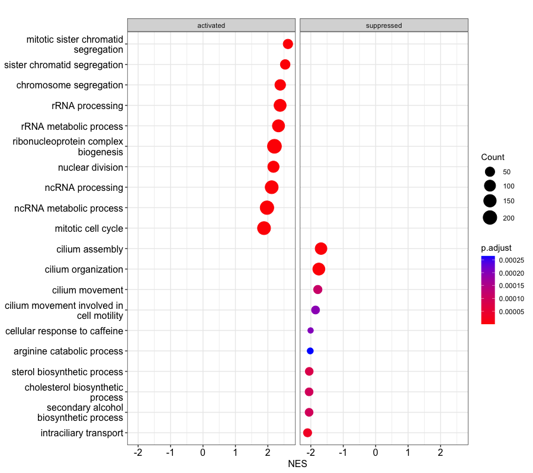
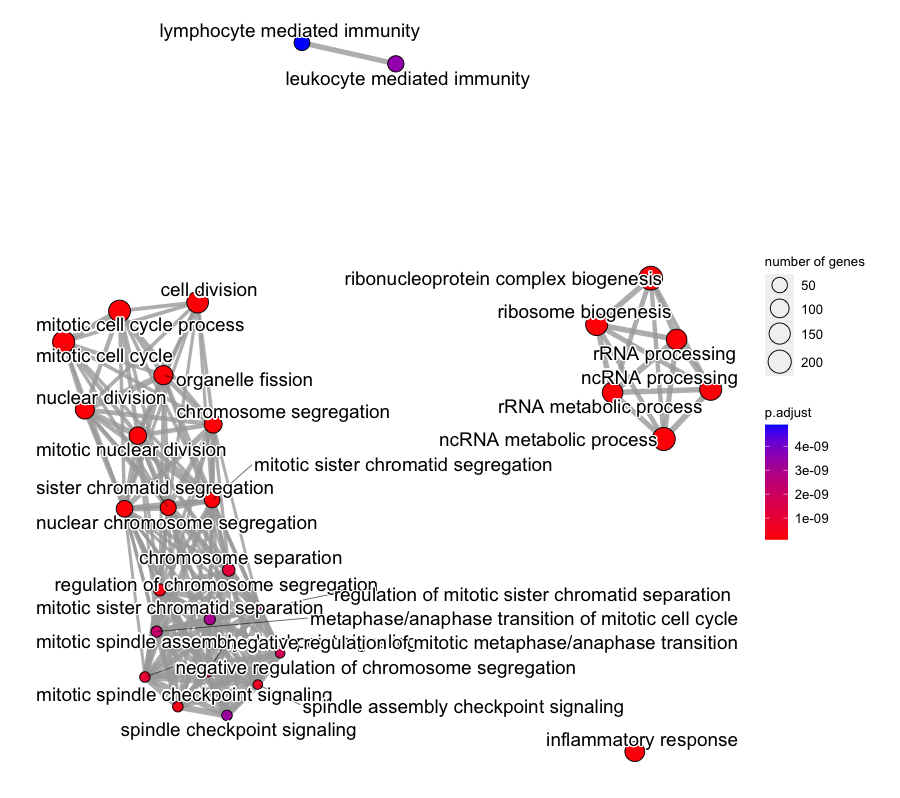
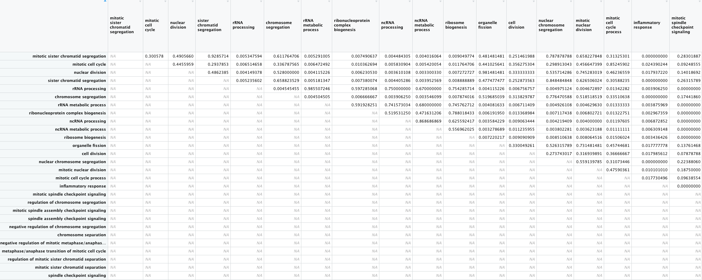
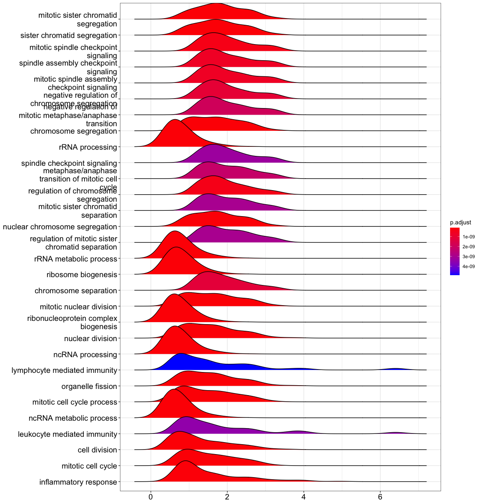

---
# Please do not edit this file directly; it is auto generated.
# Instead, please edit 09-EnrichmentAnalysis.md in _episodes_rmd/
source: Rmd
title: "Hands On: Performing Enrichment Analysis on Differentially Expressed Genes" 
exercises: 45
objectives:
- Gain functional insight from a list of differetially expressed genes
- Perform a GO enrichment analysis
- Simplify the results of the GO enrichment analysis
---

## Preparing the environment

1. **Load required packages:** These packages should already be installed in your environment, and some of them may already be loaded from previous tutorials. Still, we assume that all of these are in your environment to complete this tutorial: 

~~~
library(ggplot2) #graphics
library(clusterProfiler) #package that does most of the actual GO term analyses
library(enrichplot) #graphics for GO term enrichment
library(ggridges) #graphics
library(ggnewscale) #graphics
library(europepmc) #lets us query the PMC publication database
~~~
{: .language-r}
  
2. **Load data file**: You should already have the `pregnant_lactate_limma` data frame in your environment, but if not: 

~~~
pregnant_lactate_limma <- read.csv("limma-voom_basalpregnant-basallactate.csv",header=TRUE)
~~~

## Introduction to GO Term Enrichment Analysis

When we have a large list of genes of interest, such as a list of differentially expressed genes obtained from an RNA-Seq experiment, how do we extract biological meaning from it?

One way to do so is to perform functional enrichment analysis. This method consists of applying statistical tests to verify if genes of interest are more often associated to certain biological functions than what would be expected in a random set of genes. In this tutorial you will learn about enrichment analysis and how to perform it.

## What is the Gene Ontology?

The Gene Ontology (GO) is a structured, controlled vocabulary for the classification of gene function at the molecular and cellular level. It is divided in three separate sub-ontologies or GO types: biological process (e.g., signal transduction), molecular function (e.g., ATPase activity) and cellular component (e.g., ribosome). These sub-ontologies are structured as directed acyclic graphs (a hierarchy with multi-parenting) of GO terms.

This week, we are going to focus on the **Biological Function** GO type. Here is an example of the hierarchy that would get you from a relatively specific biological processs, **`negative regulation of programmed cell death`** all the way back up to the general **`biological_process`** term. You can see that terms can be related to one another by a variety of different relationships, such as **Positive or negative regulation** or being **Part of** another term.

## What actually happens when we perform functional enrichment?

### First, we gather the data we need:

-   A set of genes of interest (e.g., differentially expressed genes): Our differentially expressed genes

-   A set with all the genes to consider in the analysis: population set (which must contain the study set): In this case, all genes in the mouse genome

-   GO annotations, associating the genes in the population set to GO terms

-   The GO ontology, with the description of GO terms and their relationships

### Then, we plan calculate enrichment values:

For each GO term, we need to count the frequency (k) of genes in the study set (n) that are associated to the term, and the frequency (K) of genes in the population set (N) that are associated to the same term. Then we test how likely would it be to obtain at least k genes associated to the term if n genes would be randomly sampled from the population, given the frequency K and size N of the population. **That is, how unlikely is it that a particular GO Term would occur so frequently in our sample of differentially expressed genes just by chance, compared to the background.**

**The appropriate statistical test is the one-tailed variant of Fisher's exact test, also known as the hypergeometric test for over-representation.** When the one-tailed version is applied, this test will compute the probability of observing at least the sample frequency, given the population frequency. The hypergeometric distribution measures precisely the probability of k successes in n draws, without replacement, from a finite population of size N that contains exactly K successful objects:

## Hands-On: Conducting a GO Term Enrichment Analysis

We already have our `pregnant_lactate_limma` object loaded into RStudio, so we aleady have all of the information from our DE analysis that we need. We need to re-arrange this data a bit so it is in a `named vector` of just the `Log fold change`, each value named after its corresponding `EntrezID` and sorted in decreasing order by the fold change as required by the **`clusterProfiler`** package we will be using.

### Preparing our DE input

~~~
# we want the log2 fold change stored as a vector
original_gene_list <- pregnant_lactate_limma$logFC

# name the vector with the EntrezIDs
names(original_gene_list) <-pregnant_lactate_limma$ENTREZID

# omit any NA values (here shouldn't be any missing values for either variable, but this is always a good thing to check.) 
gene_list<-na.omit(original_gene_list)

# sort the list in decreasing order (required for clusterProfiler)
gene_list = sort(gene_list, decreasing = TRUE)
~~~
{: .language-r}

You should now have a named vector called `gene_list` in your environment.

> ## How many items are in the `gene_list` object? What do each of them represent?
>
> `14187 items`. Each of these represent the `log(2)fold` change of one differentially expressed gene, and the corresponding `EntrezID`.
>
> You can look at the `gene_list` item under **Values** in your **Environment Pane** to find this information.
>
> Alternatively, you can run either of the following commands to get the same information.
>
> 
> ~~~
> length(gene_list)
> ~~~
> {: .language-r}
> 
> 
> 
> ~~~
> [1] 14187
> ~~~
> {: .output}
> 
> 
> 
> ~~~
> str(gene_list)
> ~~~
> {: .language-r}
> 
> 
> 
> ~~~
>  Named num [1:14187] 6.45 6.35 5.52 5.33 5.3 ...
>  - attr(*, "names")= chr [1:14187] "140474" "16071" "71874" "12740" ...
> ~~~
> {: .output}
>
{: .solution}

### Loading mouse genome GO annotations

I'm using data generated from differential expression in mice, so I install and load the annotation "org.Mm.eg.db" below, which contains all of the GO terms available for genes in the mouse genome. If you want to work on a different organism, there are ready-to-go GO annotation sets for 19 of the most commonly used model organisms. Look up the code for your particular organism here: <http://bioconductor.org/packages/release/BiocViews.html#___OrgDb>

**Because of the large file size, I have already installed the mouse GO annotation package for you using the commands below:**

~~~
# SET THE DESIRED ORGANISM HERE
organism = "org.Mm.eg.db"
# Install annotation set like a Bioconductor package
BiocManager::install(organism, character.only = TRUE)
~~~
{: .language-r}

**You just need to run the following command to load the annotation package into your environment**

~~~
library(organism, character.only = TRUE)
~~~
{: .language-r}

### Gene Set Enrichment

We are going to be running the following command to do a gene set enrichment analysis:

~~~
gse <- gseGO(geneList=gene_list, 
             ont ="BP", 
             keyType = "ENTREZID",
             minGSSize = 3, 
             maxGSSize = 800, 
             pvalueCutoff = 0.05, 
             verbose = TRUE, 
             OrgDb = organism, 
             pAdjustMethod = "none")
~~~
{: .language-r}

Let's see what each of these parameters do:

-   **geneList:** Where are we storing our list of genes that we created above?

-   **ont:** Choose one of the three GO term sub-ontologies to get GO terms from (BP = biological process, MF = molecular function, CC = cellular component, ALL = all three).

-   **keyType:** This is how our genes are identified in our data set**.** The options vary for each organism's annotation, but can include `ENTREZID`, `REFSEQ`, `ENSEMBL` IDs among many other possibilities. This tells this function how to connect the ID numbers to GO terms.

-   **minGSSize:** minimum size of each geneSet for analyzing. For example, `minGSSize = 3` tells gsea() to set aside any GO terms that have three or fewer genes annotated with that term. GO terms with few genes generally do not contribute much to enrichment analysis.

-   **maxGSSize:** Maximum size of each geneSet for analyzing. For example, `maxGSSize = 800` tells gsea() to set aside any GO terms more than 800 genes annotated with that term. GO terms with many genes tend to be very general, non-specific GO terms which would not be particularly interesting to us biologically.

-   **pvalueCutoff:** Significance threshhold for deciding whether a GO term is significantly enriched in our data set compared with the background of all mouse genes.

-   **verbose:** Should this function report back lots of info as it runs in case we need to troubleshoot?

-   **OrgDb:** Where are we storing the annotation info for the organism of our choice?

-   **pAdjustMethod:** How are we adjusting our p-value for multiple testing or false discovery rate? Discussion of these methods is outside the scope of this course.

**Okay, let's actually run this command!** You will probably see a lot of info on your screen and it may take a moment to run. You can ignore any warnings for now!

~~~
gse <- gseGO(geneList=gene_list, 
             ont ="BP", 
             keyType = "ENTREZID",
             minGSSize = 3, 
             maxGSSize = 800, 
             pvalueCutoff = 0.05, 
             verbose = TRUE, 
             OrgDb = organism, 
             pAdjustMethod = "none")
~~~
{: .language-r}

~~~
preparing geneSet collections...
~~~
{: .output}

~~~
GSEA analysis...
~~~
{: .output}

~~~
Warning in preparePathwaysAndStats(pathways, stats, minSize, maxSize, gseaParam, : There are ties in the preranked stats (0.03% of the list).
The order of those tied genes will be arbitrary, which may produce unexpected results.
~~~
{: .warning}

~~~
Warning in fgseaMultilevel(...): For some pathways, in reality P-values are less
than 1e-10. You can set the `eps` argument to zero for better estimation.
~~~
{: .warning}

~~~
leading edge analysis...
~~~
{: .output}

~~~
done...
~~~
{: .output}

> ## Workaround if gseGO() stalls 
>  I have run gseGO() on this tutorial data set myself and exported it such that you can upload `gse` object directly into R if the **gseGO()** function is taking forever.  
> 
> 1. Download this file and upload it to RStudio Cloud: [gse_tutorial.RData](../files/gse_tutorial.RData). 
> 2. Upload this file into RStudio as you did for the Volcano Plot script or any other file you need to get into RStudio. 
> 3. Then, just click on the name of the file in your "Files" pane. 
> 4. R should automatically run a load() function, and the object "gse" should appear in your environment!
> 
{: .callout} 

## Examining GO term enrichment results

### Dataframe of results

As long as you now have a large (99 MB) object called `gse` in your environment, you are good to go! There are two really interesting objects that are part of the big list of results stored in `gse`. The first is a `data frame` containing the results:

~~~
# Save the results dataframe as its own object so we can manipulate it. Use the "@" operator to select this part of the whole list. 
pregnant_lactate_gsea_BP <- gse@result
str(pregnant_lactate_gsea_BP)
~~~
{: .language-r}

~~~
'data.frame':	1491 obs. of  11 variables:
 $ ID             : chr  "GO:0000070" "GO:0000278" "GO:0000280" "GO:0000819" ...
 $ Description    : chr  "mitotic sister chromatid segregation" "mitotic cell cycle" "nuclear division" "sister chromatid segregation" ...
 $ setSize        : int  146 759 356 170 211 474 285 219 399 357 ...
 $ enrichmentScore: num  0.687 0.441 0.527 0.658 0.601 ...
 $ NES            : num  2.58 1.88 2.17 2.52 2.36 ...
 $ pvalue         : num  1e-10 1e-10 1e-10 1e-10 1e-10 ...
 $ p.adjust       : num  1e-10 1e-10 1e-10 1e-10 1e-10 ...
 $ qvalues        : num  5.39e-08 5.39e-08 5.39e-08 5.39e-08 5.39e-08 ...
 $ rank           : num  1442 2015 1999 1442 3847 ...
 $ leading_edge   : chr  "tags=36%, list=10%, signal=32%" "tags=23%, list=14%, signal=21%" "tags=30%, list=14%, signal=26%" "tags=33%, list=10%, signal=30%" ...
 $ core_enrichment: chr  "20877/12235/71819/268697/66977/54392/12704/52276/72107/26934/110033/12236/208628/70218/68612/18817/18005/67052/"| __truncated__ "20877/404710/12235/66468/100502766/71819/11636/24108/268697/74107/66977/77011/54392/12704/52276/108000/72107/26"| __truncated__ "16878/20877/12235/100502766/71819/268697/14087/66977/54392/12704/52276/72107/26934/72119/110033/12236/19361/208"| __truncated__ "20877/12235/71819/268697/66977/54392/12704/52276/72107/26934/110033/12236/208628/70218/71988/68612/18817/18005/"| __truncated__ ...
~~~
{: .output}

There is a lot going on in the `pregnant_lactate_gsea_BP` data frame we just extracted, but here are some highlights. There is one row for each significantly enriched biological process GO term from our Gene Enrichment analysis.

-   **ID:** The official GO term ID

-   **Description:** Brief description of the biological process associated with a GO Term ID

-   **setSize:** The number of genes annotated with a particular GO term. One gene can potentially be annotated with many GO terms.

-   **p-value:** Result of testing for whether a GO term is significantly enriched in our data set compared with the background of all mouse genes.

-   **NES**: Normalized Enrichment Score. The primary result of the gene set enrichment analysis is the enrichment score (ES), which reflects the degree to which a gene set is overrepresented at the top or bottom of a ranked list of genes. The sign on the score simply indicates when end of your ranked gene list is enriched. You provide the rank list of genes, so the biological interpretation is up to you. **Since our genes were ranked by FoldChange, then the positive scores are associated with upregulated genes and negative scores are associated with downregulated genes (with respect to the `pregnant` samples in this example). By normalizing the enrichment score, GSEA accounts for differences in gene set size and in correlations between gene sets and the expression dataset, making NES values more comparable across data sets**

> ## What is the average number of genes per GO term?
>
> Think back to one of our old favorite basic R functions, mean().
>
> 
> ~~~
> mean(pregnant_lactate_gsea_BP$setSize)
> ~~~
> {: .language-r}
> 
> 
> 
> ~~~
> [1] 109.3374
> ~~~
> {: .output}
>
> This means (hah) that there are on average about 108 genes that were annotated with each GO term. 
{: .solution}

### Lists of genes per GO Term

The `geneSets` item in the `gse` results will likely be something useful if you were interested in knowing more about the genes that were annotated with a particular GO term. Looking at its structure, we can see that `geneSets` is a list of vectors, one per GO term. **Each vector contains the EntrezIDs of the genes annotated with that GO term, for each GO term in the analysis whether it was significantly enriched or not.**

~~~
str(gse@geneSets)
~~~
{: .language-r}

~~~
List of 16010
 $ GO:0000002: chr [1:26] "11545" "12628" "16882" "17258" ...
 $ GO:0000003: chr [1:1618] "11287" "11352" "11421" "11430" ...
 $ GO:0000012: chr [1:13] "11545" "14211" "21958" "22064" ...
 $ GO:0000017: chr [1:2] "20537" "246787"
 $ GO:0000018: chr [1:112] "11545" "12053" "12144" "12487" ...
 $ GO:0000019: chr [1:7] "12144" "13871" "17350" "19360" ...
 $ GO:0000022: chr [1:6] "20877" "26934" "71819" "74393" ...
 $ GO:0000027: chr [1:27] "11837" "12181" "17725" "19988" ...
 $ GO:0000028: chr [1:20] "16785" "16898" "17724" "19090" ...
 $ GO:0000032: chr [1:2] "110119" "331026"
 $ GO:0000038: chr [1:35] "11430" "11666" "12686" "14081" ...
 $ GO:0000041: chr [1:110] "11306" "11774" "11776" "11927" ...
 $ GO:0000045: chr [1:95] "11793" "11938" "12421" "13033" ...
 $ GO:0000050: chr [1:10] "11846" "11847" "11898" "12606" ...
 $ GO:0000052: chr [1:8] "11898" "15194" "18416" "51793" ...
 $ GO:0000053: chr [1:2] "11898" "109900"
 $ GO:0000054: chr [1:16] "16418" "18148" "19069" "19384" ...
 $ GO:0000055: chr [1:9] "18148" "19069" "19384" "19428" ...
 $ GO:0000056: chr [1:10] "18148" "19069" "19384" "19428" ...
 $ GO:0000070: chr [1:159] "11789" "11799" "11920" "12235" ...
 $ GO:0000075: chr [1:175] "11789" "11799" "11909" "11920" ...
 $ GO:0000076: chr [1:16] "15574" "18392" "19356" "19367" ...
 $ GO:0000077: chr [1:110] "11909" "11920" "12144" "12189" ...
 $ GO:0000079: chr [1:72] "11461" "11491" "11651" "11789" ...
 $ GO:0000080: chr [1:2] "320558" "637277"
 $ GO:0000082: chr [1:194] "11477" "11479" "11491" "11504" ...
 $ GO:0000083: chr [1:18] "12013" "12568" "13555" "18555" ...
 $ GO:0000085: chr "50883"
 $ GO:0000086: chr [1:134] "11799" "11820" "11920" "12013" ...
 $ GO:0000087: chr [1:2] "18023" "107995"
 $ GO:0000089: chr [1:2] "18023" "107995"
 $ GO:0000096: chr [1:32] "11611" "11720" "12116" "12286" ...
 $ GO:0000097: chr [1:15] "12116" "12411" "14598" "17769" ...
 $ GO:0000098: chr [1:7] "11611" "11720" "12411" "12583" ...
 $ GO:0000101: chr [1:7] "18023" "20510" "20532" "30962" ...
 $ GO:0000103: chr [1:4] "23971" "23972" "53315" "54200"
 $ GO:0000105: chr [1:2] "108156" "665563"
 $ GO:0000117: chr [1:2] "12013" "26380"
 $ GO:0000122: chr [1:950] "11481" "11568" "11569" "11614" ...
 $ GO:0000132: chr [1:32] "12615" "13191" "14048" "14165" ...
 $ GO:0000154: chr [1:31] "14113" "14791" "15278" "52530" ...
 $ GO:0000165: chr [1:794] "11350" "11352" "11441" "11450" ...
 $ GO:0000183: chr [1:9] "18676" "20937" "21429" "93759" ...
 $ GO:0000184: chr [1:38] "14852" "14853" "16341" "17149" ...
 $ GO:0000209: chr [1:248] "11796" "11797" "12005" "12021" ...
 $ GO:0000212: chr [1:19] "12316" "12442" "17451" "17886" ...
 $ GO:0000226: chr [1:619] "11350" "11603" "11789" "11799" ...
 $ GO:0000237: chr [1:6] "17350" "21749" "22210" "22596" ...
 $ GO:0000239: chr [1:4] "57746" "57749" "110957" "671232"
 $ GO:0000244: chr [1:9] "22258" "27756" "28000" "53890" ...
 $ GO:0000245: chr [1:46] "13046" "14007" "14105" "19655" ...
 $ GO:0000255: chr [1:13] "11486" "14544" "18950" "22262" ...
 $ GO:0000256: chr "94041"
 $ GO:0000266: chr [1:47] "11774" "12176" "13179" "14245" ...
 $ GO:0000270: chr [1:6] "21946" "57757" "69541" "242100" ...
 $ GO:0000271: chr [1:72] "11364" "11651" "11652" "11771" ...
 $ GO:0000272: chr [1:22] "11548" "11554" "12421" "12655" ...
 $ GO:0000278: chr [1:847] "11350" "11477" "11479" "11491" ...
 $ GO:0000279: chr [1:12] "17350" "18023" "21749" "22210" ...
 $ GO:0000280: chr [1:442] "11789" "11799" "11848" "11920" ...
 $ GO:0000281: chr [1:67] "11735" "11789" "11799" "11840" ...
 $ GO:0000288: chr [1:52] "12192" "12193" "12227" "12457" ...
 $ GO:0000289: chr [1:27] "12227" "17350" "18458" "18983" ...
 $ GO:0000290: chr [1:11] "12457" "18983" "67207" "67578" ...
 $ GO:0000291: chr [1:16] "18983" "27998" "50911" "66362" ...
 $ GO:0000294: chr [1:2] "19704" "230738"
 $ GO:0000296: chr "74772"
 $ GO:0000301: chr [1:2] "13047" "27277"
 $ GO:0000302: chr [1:189] "11350" "11502" "11545" "11651" ...
 $ GO:0000303: chr [1:22] "11545" "11808" "11977" "12460" ...
 $ GO:0000304: chr "14360"
 $ GO:0000305: chr [1:23] "11545" "11808" "11977" "12460" ...
 $ GO:0000320: chr [1:4] "12443" "12449" "17869" "56637"
 $ GO:0000338: chr [1:10] "12848" "26572" "26754" "26891" ...
 $ GO:0000349: chr [1:2] "28000" "67439"
 $ GO:0000350: chr [1:2] "57905" "67229"
 $ GO:0000375: chr [1:279] "11758" "11834" "12261" "12696" ...
 $ GO:0000377: chr [1:279] "11758" "11834" "12261" "12696" ...
 $ GO:0000378: chr "28088"
 $ GO:0000379: chr [1:3] "66078" "76265" "381802"
 $ GO:0000380: chr [1:75] "13046" "13207" "13211" "13548" ...
 $ GO:0000381: chr [1:59] "13046" "13207" "13548" "13992" ...
 $ GO:0000387: chr [1:32] "12729" "12812" "20595" "20630" ...
 $ GO:0000388: chr "320632"
 $ GO:0000389: chr [1:2] "57905" "193116"
 $ GO:0000390: chr [1:2] "54723" "217207"
 $ GO:0000393: chr [1:5] "28000" "57905" "67229" "67439" ...
 $ GO:0000394: chr [1:11] "28088" "66078" "66637" "67106" ...
 $ GO:0000395: chr [1:6] "20630" "101739" "110809" "231769" ...
 $ GO:0000398: chr [1:279] "11758" "11834" "12261" "12696" ...
 $ GO:0000409: chr "17977"
 $ GO:0000411: chr "17977"
 $ GO:0000413: chr [1:23] "14225" "14226" "14228" "14229" ...
 $ GO:0000414: chr [1:8] "14194" "18193" "55982" "57261" ...
 $ GO:0000415: chr [1:2] "14194" "71458"
 $ GO:0000416: chr [1:4] "55982" "57261" "213389" "234135"
 $ GO:0000422: chr [1:74] "11739" "11740" "11793" "11983" ...
 $ GO:0000423: chr [1:31] "11739" "11740" "12034" "12539" ...
 $ GO:0000425: chr "381375"
  [list output truncated]
~~~
{: .output}

Let's say that we wanted to know which genes were associated with the <GO:0000085>, which corresponds to the **mitotic G2 phase** biological process:

~~~
gse@geneSets$`GO:0000085`
~~~
{: .language-r}

~~~
[1] "50883"
~~~
{: .output}

As we can see, there is only one gene in there (EntrezID = 50883). Looking up this ID on NCBI we can see that this corresponds to the `**Chek2 checkpoint kinase 2**`, which makes a lot of sense given the biological process GO term above.

## Visualizing GO Term Enrichment Results

The `**clusterProfiler**` package has a variety of options for viewing the over-represented GO terms. I will go through a few typical types of plots, although there are many other possibilities for you to explore on your own.

### Dotplots

The following command will produce a **dotplot**

~~~
dotplot(gse, showCategory=10)
~~~
{: .language-r}

*Dotplot using our enrichment results, showing top 10 GO categories and otherwise using default parameters*

The dotplot shows the number of genes associated with the Top 10 most enriched GO terms and adjusted p-values for these terms (color). The terms are ordered on the X-axis by the `**GeneRatio**` variable by default, which is simply the `count/setSize` for a GO term, where the `count` is the number of genes in a GeneSet (i.e. annotated with that particular GO term) and the `setSize` is the number of genes in the background mouse annotation dataset. Basically, another way of visualizing group size.

I have adjusted the plot dotpot so that it now shows the top 20 GO terms and has the Normalized Enrichment Score on the x-axis, to help us understand whether these GO terms are generally upregulated or downregulated in the `basalpregnant vs. basallactate` comparison.

 *The dotplot shows the number of genes associated with the first 20 GO terms (by size) and the p-adjusted values for these terms (color). The terms are ordered on the X-axis by the `**Normalized Enrichment Score**` variable*

> ## What command produced this version of the dotplot?
>
> First, we adjust the `showCategory` parameter to be 20 instead of 10.
>
> Second, you will need to use the `help("dotplot")` command to see all of the options for this command to see which parameter changes the x-axis.
>
> Putting this all together and running `dotplot()` again:
>
> 
> ~~~
> dotplot(gse, showCategory=20,x="NES")
> ~~~
> {: .language-r}
>
> Try running this on your own to make sure it works! 
{: .solution} 

We may also want to be able to modify this plot further, to separate out which top GO Term categories are relative activated (upregulated - positive NES) or suppressed (downregulated - negative NES). We can do exactly this by telling `**dotplot()**` to split tne NES values by their `sign` , and then tell R to plot each sign in a separate `facet`, or panel.

~~~
#Make sure to include the periods!
dotplot(gse, showCategory=10,x="NES", split=".sign") + facet_grid(.~.sign)
~~~
{: .language-r}

*Two-panel dotplot showing us which of the Top 20 largest GO Term groups are generally upregulated (positive NES, left panel), or generally downregulated (negative NES, right panel.*

### Enrichment Maps

Enrichment maps are a great way to explore which GO terms might form functional clusters of related genes. An enrichment map organizes significanly GO enriched terms into a network with edges connecting overlapping gene sets. In this way, mutually overlapping gene sets tend to cluster together, making it easy to identify potential functional modules. We can generate an enrichment map of the top GO terms from our data set in two steps: 

~~~
# First, generate a matrix of pairwise similarities between GO terms based on the overlap between their lists of genes
gse1 <- pairwise_termsim(gse)

# We can extract the data frame that contains the calculated pairwise distances between the GO terms 
termsim_table <- gse1@termsim
str(termsim_table)
~~~
{: .language-r}

~~~
#Then, simply use the emapplot() function to create a network of overlaps between signifiant GO terms: 
emapplot(gse1)
~~~
{: .language-r}

*Enrichment map of the top significantly enriched GO terms amongst the differentially expressed genes from our basalpregnant vs. pregnantlactate comparison.*

**Interpreting the enrichment map**: In the background, the emapplot() function has a minimum similarity threshold for whether two terms are connected. The default value of this thresh is 0.2, for a value that ranges from 0.0 (no overlapping genes) to 1.0 (complete overlap). The default layout algorithm causes gene sets with high overlap to cluster closely together. **Intuitively, this means that tight clusters of GO terms have high amounts of overlap between them, and vice versa. One thing we notice is that some GO terms are not linked to any other, or very few, other terms.** 

Here is a screenshot of a portion of the Pairwise Similarity Matrix. We can compare what we notice about the `inflammatory response` in the Enrichment Map, and what we see in the table in the similarity table. 

*Portion of the table of pairwise similarities between GO terms. Looking at the "inflammatory response" column, we can see that all of the values are very small (less than the 0.2 thresshold). This is played out in the enrichment plot, in which that GO term is not connected to any other terms*. 

**One important parameter you can change is the `layout` parameter, which allows you to choose how you would like mapping results to be displayed.** Just for fun, let's try modifying that parameter to `star`, which should be fairly self-explanatory once you see those results!

~~~
# We can extract the data frame that contains the calculated pairwise distances between the GO terms 
emapplot(gse1,layout="star")
~~~
{: .language-r}

*Enrichment map of the top significantly enriched GO terms amongst the differentially expressed genes from our basalpregnant vs. pregnantlactate comparison, with a `star` layout. Notice that the "inflammatory response" GO term is still off by itself on the lefthand side of the plot*

### Ridgeline Plots

Ridgeline plots help combine our information about our significantly enriched GO terms and the actual logfold changes reported for the differentially expressed genes within that group. 

~~~
ridgeplot(gse1)
~~~
{: .language-r}

